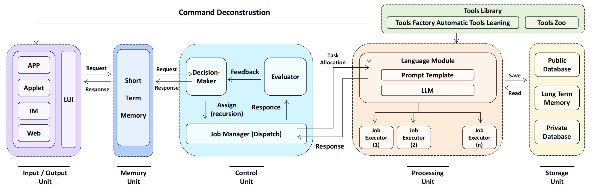
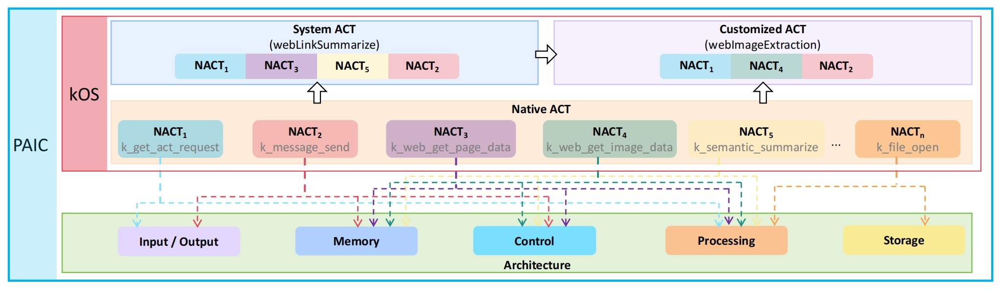

# Personal Autonomous Intelligence Computer (PAIC)

**Authors:** Hanqing Wu, Zile Yang, Jiahuan Zhang, Dongbai Chen, Baoping Hao, Hao Zhang, Hongying Han, Wenlin Fu, Kaicheng Yu

**Abstract:**
In this position paper, we introduce a concept of personal autonomous intelligence computer~(PAIC), to combine the advantage of two mainstream intelligence systems, connectionism and rule-based symbolism. Similar to a traditional von Neumann architecture, our PAIC consists of the input-output, memory, control, processing, and storage Unit. PAIC not only removes the limitation of the fix-length context window from the large language model but also achieves multi-hop reasoning-related precise manipulation of input with a novel pipeline. We also argue that, with the progressive increase of PAIC users on the Internet, the data flow of the current Internet will be reformed to achieve a decentralized local network.

[Paper](https://github.com/KMind-Inc/PAIC/blob/main/Main%20Paper/PAIC_Paper.pdf)

[Webpage Portal](https://hikos.cn/)

## Architecture Design


## kOS: An Operating System for PAIC

### Native ACT
Coming Soon
### System ACT
Coming Soon
### Customized ACT
Coming Soon


*Please cite our paper as below if you use our work.*
```
xxxxx
```

